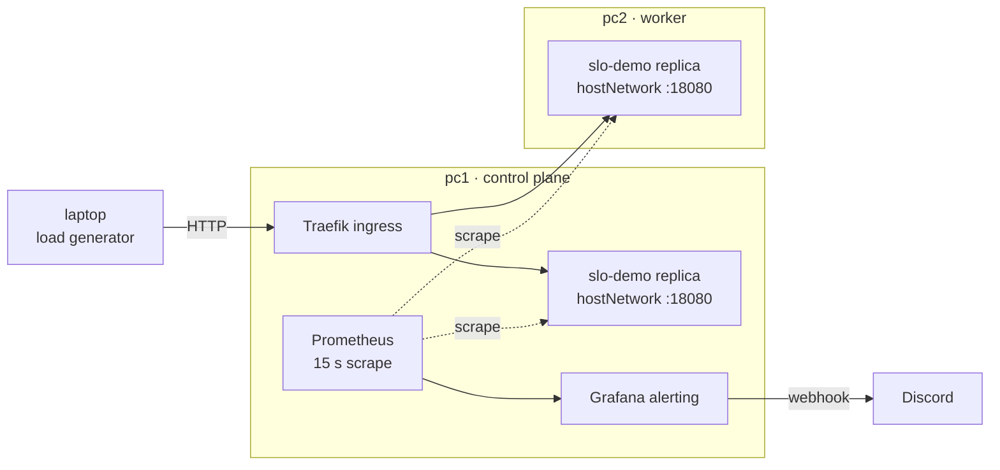

# homelab-slo-platform

A three-PC home-lab Kubernetes platform run like production. A small service gets SLOs and multiwindow burn-rate alerting to Discord. Five failure drills then break it on purpose and record what the alerts did.

**Highlights**

- **SLOs:** 99.5% availability and 99% latency (under 250 ms) over a 30-day window, with error budgets worked out in requests as well as percentages.
- **Alerting:** a fast-burn page (14.4x over 1 h and 5 m) and a slow-burn ticket (6x over 6 h and 30 m), following chapter 5 of the Google SRE Workbook.
- **Drills:** five of them (error injection, node failure, latency injection, slow burn and rolling deploy), each written up with a timeline and findings in [`drills/`](drills/).
- **Bugs found:** the slow-burn drill uncovered two wrong alert rules and a page with no contact point. All three are fixed.

## Architecture



- **Nodes:** three Windows machines (pc1, pc2 and a laptop) each run a Linux node under WSL2, with k3s on top. pc1 runs the control plane, monitoring and the Traefik ingress.
- **Service:** `slo-demo` is a small HTTP service with two replicas, one on pc1 and one on pc2. Node affinity keeps it off the laptop, because the laptop sleeps and moves between networks.
- **Fault injection:** the `slo-demo-fault` ConfigMap sets `error_rate` and `latency_ms`. Pods pick up a change in about a minute.
- **Load:** `scripts/load.sh` generates closed-loop load and `scripts/load-open.sh` generates open-loop load.

### WSL2 networking notes

- **hostNetwork on port 18080:** WSL2 mirrored networking only forwards inbound traffic to ports opened by a Linux process. Flannel's VXLAN port is opened by the kernel, so pod-to-pod traffic never arrived and NodePorts were unreachable from the LAN. The replicas therefore run with `hostNetwork: true` on port 18080, at the cost of one replica per node.
- **MTU 1400:** pc2 dropped full-size packets at the default MTU of 1500, so eth0 is set to 1400 on the WSL nodes.
- **Known risk:** monitoring shares pc1 with the control plane. If pc1 goes down, the API and monitoring go with it.

## SLOs

The window is 30 days, rolling, measured on `/`. Full definitions are in [`SLO.md`](SLO.md).

| SLO | Target | Error budget |
|---|---|---|
| Availability (non-5xx) | 99.5% | 0.5% of requests: about 3.6 h of full outage, or 129,600 failed requests at 10 req/s |
| Latency (under 250 ms) | 99% | 1% of requests: about 7.2 h of all-slow traffic, or 259,200 slow requests at 10 req/s |

Why these targets:

- **Not 99.9%:** it allows only about 43 minutes a month, and one node failure plus detection time could use that up.
- **250 ms:** it's a histogram bucket boundary, so the SLI can be counted exactly from the histogram.
- **Bigger latency budget:** latency gets a larger budget than availability.

## Alerting

The alerts are multiwindow and multi-burn-rate (Google SRE Workbook, chapter 5). Both tiers notify Discord.

| Alert | Burn rate | Windows | Availability threshold | Action |
|---|---|---|---|---|
| Fast burn | 14.4x | 1 h and 5 m | 7.2% errors | Page |
| Slow burn | 6x | 6 h and 30 m | 3% errors | Ticket |

The rules use the `> bool` form, so they always return 0 or 1 instead of returning no data when healthy:

```promql
# Fast burn (page)
(slo:availability_errors:ratio_rate1h > bool 0.072) * (slo:availability_errors:ratio_rate5m > bool 0.072)

# Slow burn (ticket)
(slo:availability_errors:ratio_rate6h > bool 0.03) * (slo:availability_errors:ratio_rate30m > bool 0.03)
```

## Failure drills

Full timelines are in [`drills/`](drills/).

| # | Date (IST) | Drill | Result |
|---|---|---|---|
| 1 | 2026-09-30 | Error injection: 50% errors for 16 min 43 s | Page at +12 min 10 s; about 4% of the error budget used; page cleared 5 min 27 s after the fix |
| 2 | 2026-09-30 | Node failure: pc2's WSL shut down for 5 min 8 s | Node NotReady in 21 s; pc1 serving the traffic by +34 s; 0 failures in about 1,900 logged requests (the first 34 s went unlogged). The availability SLI did not register the failure |
| 3 | 2026-09-30 | Latency injection: +400 ms for 30 min 44 s | Page at +15 min 4 s and ticket at +29 min 59 s; 6.7% of the latency budget used |
| 4 | 2026-10-01 | Slow burn: 5% errors for 3 h 54 min | Ticket at +3 h 27 min and no page, as designed; 5.1% of the error budget used |
| 5 | 2026-10-01 | Rolling deploy: 3 rollout restarts one minute apart, under load | 0 failures in 2,053 requests; each replica out of rotation for 6–11 s |

## What the drills found

1. **Measure SLIs at the edge.** The availability SLI comes from the app's own counters. A replica that disappears reports nothing, so the SLI stays clean (Drill 2). The next step is to compute SLIs from Traefik ingress metrics.
2. **Test each alert tier between its threshold and the next.** Earlier drills used faults big enough to cross both thresholds, which hid two wrong rules: the fast rule used the slow windows, and the slow threshold was 2.4x too high. The 5% slow-burn drill exposed both, and showed that the page had no contact point (Drill 4). All three are fixed.
3. **hostNetwork limits rescheduling.** When a node fails, its replacement pod can't run on pc1, where port 18080 is taken, or on the laptop, which affinity excludes. So it stays Pending. The options are to raise `tolerationSeconds` for the not-ready and unreachable taints, or to add an eligible node (Drill 2).
4. **Use open-loop load for latency tests.** A closed-loop generator would have dropped to about 2 req/s at 400 ms latency and hidden the problem; this effect is called coordinated omission (Drill 3).
5. **Detection time depends on traffic in the long window.** Two forgotten load generators had doubled earlier traffic, so the page fired about 4 minutes later than estimated (Drill 3). A traffic gap during warm-up made the ticket fire about 14 minutes early (Drill 4).
6. **Histogram buckets matter.** The buckets jump from 0.25 s to 0.5 s, so a p99 near the threshold (about 0.49 s here) is an interpolation artifact (Drill 3).
7. **Rolling deploys cost no budget at this load.** With `maxUnavailable: 1`, `maxSurge: 0`, a 5 s `preStop` pause and the app refusing new connections on SIGTERM, out-of-rotation time is preStop plus startup plus the first readiness probe. Each rollout halves capacity for about 15–20 s (Drill 5).
8. **Drill hygiene.** A truncated load log hid the first 34 s of the node failure, and a safety timer died silently when its WSL session closed. Every drill now uses a fresh log, exactly one load generator, frozen alert rules and a timer that logs to a file.

## Repository layout

| Path | Contents |
|---|---|
| `drills/` | Drill write-ups 001–005 |
| `scripts/load.sh` | Closed-loop load generator |
| `scripts/load-open.sh` | Open-loop load generator (fixed request rate) |
| `SLO.md` | SLO definitions, error budgets, alerting design and the drill log |
| `cluster/`, `workloads/`, `observability/`, `chaos/`, `docs/decisions/` | Placeholders for the manifests, alert rules, dashboards and decision records (see Roadmap) |

## Roadmap

- [ ] Compute SLIs from Traefik ingress metrics.
- [ ] Fix the `slo:latency_slow:ratio_rate*` recording rules, which currently return no data so the latency alerts can't fire, then re-run the latency drill.
- [ ] Add `summary` and `runbook_url` annotations to every alert rule.
- [ ] Add histogram buckets near 250 ms (0.2 s and 0.3 s).
- [ ] Decide eviction behaviour (`tolerationSeconds`) or add an eligible node.
- [ ] Re-run the drills under better conditions:
  - Drill 1 with more than 6 h of traffic history.
  - Drill 2 with a clean log and an EndpointSlice watch.
  - Drill 5 with concurrent open-loop load and a shorter readiness probe period.
- [ ] Commit the manifests, `slo-rules.yaml`, dashboards and a pre-drill checklist.
- [ ] Write decision records for WSL2 vs Hyper-V, hostNetwork and the 99.5% target.

## Related

- [Bulwark](https://github.com/sita929/bulwark-gateway): an OpenAI-compatible LLM inference gateway with admission control, deadlines, streaming and a chaos backend for testing failures.
- A working paper on how fast burn-rate alerts detect problems uses these drills as its validation data. It's a draft and not yet published.

Built by Suman Babu.
